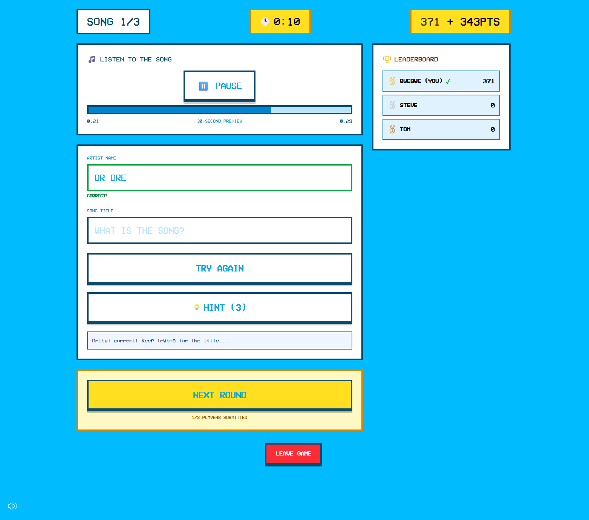
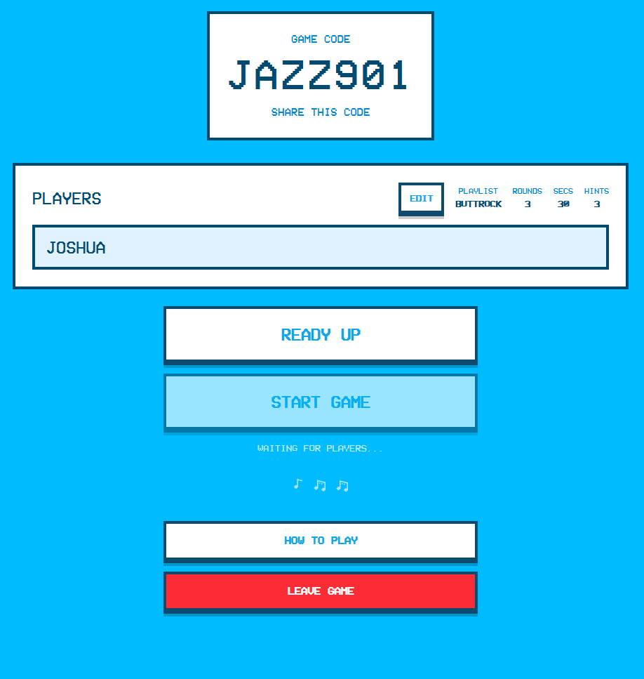
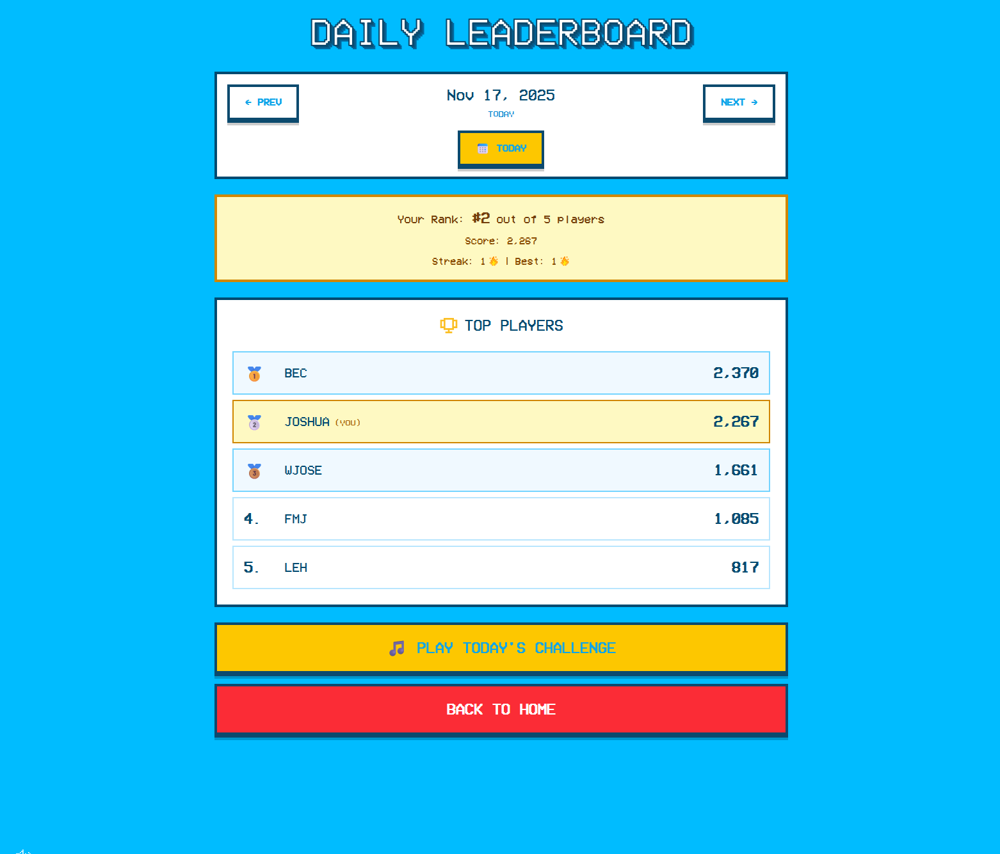

<h1 align="center">Music Round</h1>

<p align="center">A multiplayer song guessing game where players compete to identify songs from 30-second Spotify previews.</p>

<p align="center">
  
  
</p>
<p align="center">
  
  
</p>

<h2 align="center">Features</h2>

- **Multiplayer** - Real-time lobbies with shareable game codes
- **Daily Challenge** - Same songs for everyone each day, compete on the leaderboard
- **Battle Royale** - 50 rounds, 3 lives, last player standing wins
- **Solo Mode** - Practice without friends (we've all been there)
- **Hints** - Stuck? Reveal letters to help guess, but it costs points
- **Multiple Playlists** - Decades, genres, festival lineups (Glastonbury 2023-2025, etc.)

<h2 align="center">Tech Stack</h2>

- TanStack Start / React 19 / TypeScript
- Convex (real-time backend)
- Spotify Web API + Deezer fallback
- Tailwind CSS

<h2 align="center">Getting Started</h2>

### Prerequisites

- Node.js 18+ or Bun
- A Spotify Developer account

### 1. Install Dependencies

```bash
bun install
```

### 2. Set Up Convex

Initialize Convex (creates deployment and sets up environment):

```bash
npx convex dev
```

This will create a `.env.local` file with `CONVEX_DEPLOYMENT` and `VITE_CONVEX_URL`.

### 3. Set Up Spotify Integration

1. Go to [Spotify Developer Dashboard](https://developer.spotify.com/dashboard)
2. Create a new app
3. Note your **Client ID** and **Client Secret**
4. Set redirect URI to `http://localhost:3000` (required but not used)

Add Spotify credentials to Convex (server-side):

```bash
npx convex env set SPOTIFY_CLIENT_ID your_client_id_here
npx convex env set SPOTIFY_CLIENT_SECRET your_client_secret_here
```

### 4. Run the Application

Start both the dev server and Convex:

```bash
# Terminal 1: Start Convex
npx convex dev

# Terminal 2: Start app
bun run dev
```

The app will be available at `http://localhost:3000`.

<h2 align="center">Environment Variables</h2>

### Local `.env.local` (auto-generated by Convex)

```bash
CONVEX_DEPLOYMENT=your-deployment-name
VITE_CONVEX_URL=https://your-deployment.convex.cloud
```

### Convex Environment Variables (server-side)

Set these using `npx convex env set`:

```bash
SPOTIFY_CLIENT_ID=your_spotify_client_id
SPOTIFY_CLIENT_SECRET=your_spotify_client_secret
```

**Note:** Spotify credentials must be set in Convex, not in `.env.local`, as they're used server-side.

<h2 align="center">Building For Production</h2>

```bash
bun run build
```

<h2 align="center">Development</h2>

### Scripts

```bash
bun run dev      # Start dev server
bun run test     # Run tests (69 tests, ~850ms)
bun run lint     # Lint with oxlint
bun run lint:fix # Lint and auto-fix
```

### Type Checking

Uses [tsgo](https://github.com/microsoft/typescript-go) (native TypeScript compiler, experimental):

```bash
bunx tsgo --noEmit
```

### Test Stack

- **Vitest** - Test runner
- **happy-dom** - DOM environment (faster than jsdom)
- **Testing Library** - Component tests
- **convex-test** - Backend integration tests

<h2 align="center">How to Play</h2>

1. **Create a Game**: Click "Create Game" to generate a unique game code
2. **Join Lobby**: Share the game code with friends who can join the lobby
3. **Start Game**: Host starts the game when all players are ready
4. **Listen & Guess**: Each round plays a 30-second preview - guess the artist and song title
5. **Scoring**: Points decay over time (500 → 250), so faster answers score higher. Partial credit for getting just the artist or title.
6. **Win**: Player with the most points after all rounds wins!

<h2 align="center">Contributing</h2>

This project is open source for reference and learning, but I'm not accepting contributions at this time.
